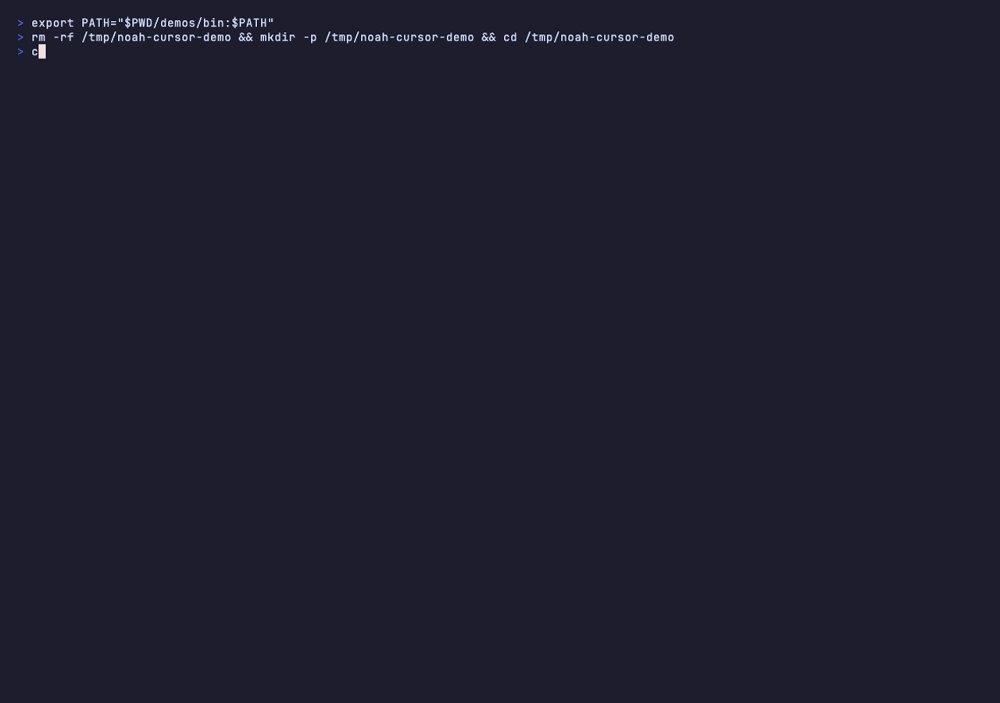

<p align="center">
  
</p>

<p align="center">
  <strong>The CLI for shipping Cursor setups that actually work.</strong><br />
  Install battle-tested Skills, Rules, and workflows into any project — in one command.
</p>

<p align="center">
  <a href="https://www.npmjs.com/package/noah-cursor"></a>
  <a href="https://www.npmjs.com/package/noah-cursor"></a>
  <a href="LICENSE"></a>
  
  <a href="https://www.buymeacoffee.com/itsmenoahpoli"></a>
</p>

```bash
npx noah-cursor add --skill commit-push
```

Stop copy-pasting Cursor prompts between repos. **Noah Cursor** is a developer CLI + curated registry: reusable Skills, Rules, Prompts, MCP configs, and Presets that drop straight into `.cursor/` — no clone, no sign-in, no friction.

## Built for your stack

<p align="center">
  
</p>

<p align="center">
  
  
  
  
  
  
  
  
</p>

Curated Skills & Rules for the stacks you already ship — React dashboards, Laravel APIs, Next/Nuxt marketing sites, NestJS, and Node.

## Why developers use it

| Pain | Noah Cursor |
| ---- | ----------- |
| Rebuilding the same Cursor setup on every project | One command installs a full workflow |
| Vague AI prompts that drift between teammates | Versioned Skills & Rules from a real registry |
| Hunting docs every time you switch stacks | Stack-specific rules for React, Laravel, Next, Nuxt |
| Manual QA loops with lint/doctor tools | Fix Skills that run → fix → verify |

Built for people who live in the terminal and want Cursor to feel like a product, not a blank slate.

## Demo

<p align="center">
  
</p>

## Quick start

Requires **Node.js 20+**.

```bash
# Try it instantly — no global install
npx noah-cursor browse

# Or install once
npm install -g noah-cursor
noah-cursor browse
```

The registry ships inside the package. Nothing to clone. Nothing to authenticate.

### 30-second wins

```bash
# Ship cleaner commits every time
npx noah-cursor add --skill commit-push

# Auto-generate a solid project README
npx noah-cursor add --skill generate-readme

# React health pass: run doctor → fix → verify
npx noah-cursor add --skill react-doctor-fix

# Stack rules for a Laravel API + React dashboard
npx noah-cursor add --rule laravel-api --rule react-spa-dashboard
```

## What you get

### Skills — agent workflows you can reuse

| Skill | What it does |
| ----- | ------------ |
|  `commit-push` | Stage, group by category, draft a clean commit, push |
|  `generate-readme` | Generate README with stack, deps, prerequisites, setup |
|  `react-doctor-fix` | Run react-doctor, fix findings, verify no regressions |
|  `larastan-fix` | Run Larastan on Laravel, fix, verify |
|  `nestjs-knip-fix` | Knip on NestJS — unused code/deps out, features intact |
|  `node-doctor-fix` | Bundled node-doctor (Knip + hygiene) for generic Node |

### Rules — stack guidance baked into Cursor

| Rule | For |
| ---- | --- |
|  `stack-architecture` | Choosing React SPA vs Laravel API vs Next/Nuxt marketing |
|  `react-spa-dashboard` | React + TypeScript + TanStack Query dashboards |
|  `laravel-api` | Headless Laravel APIs (Sanctum-ready) |
|  `nextjs-marketing` | Next.js App Router marketing / branding sites |
|  `nuxt-marketing` | Nuxt 3+ marketing / branding sites |

Prompts, MCP configs, and Presets are supported by the CLI — more shipping soon.

## Commands

| Command | Description |
| ------- | ----------- |
| `browse` | Interactive TUI — discover & install without memorizing ids |
| `add` | Install Skills, Rules, Prompts, MCP, or Presets |
| `search` | Search the registry |
| `list` | List registry or installed assets |
| `remove` | Uninstall an asset |
| `update` | Re-fetch and update installed assets |
| `doctor` | Diagnose environment health |

### browse

```bash
noah-cursor browse
noah-cursor browse --browse-skills
noah-cursor browse --browse-rules
noah-cursor browse --browse-prompts
noah-cursor browse --browse-mcp
noah-cursor browse --browse-presets
```

Controls: ↑↓ navigate · Space select · A toggle all · I invert · Enter confirm · Esc cancel

### add

```bash
noah-cursor add
  --skill <name>
  --rule <name>
  --prompt <name>
  --mcp <name>
  --preset <name>
  --all
  --force
  --dry-run
  --yes
  --verbose
```

Always installs from **Noah's bundled registry**.

```bash
npx noah-cursor add --skill commit-push
npx noah-cursor add --rule nextjs-marketing
npx noah-cursor add --all
```

### search / list / remove / update / doctor

```bash
noah-cursor search doctor
noah-cursor list
noah-cursor list --installed
noah-cursor remove skill test --yes
noah-cursor update --yes
noah-cursor doctor
```

## How it works

Assets land in your project under `.cursor/`:

```
.cursor/
  skills/
  rules/
  prompts/
  mcp/
  noah.json          # tracks what you installed
```

`noah.json` keeps versions and registry metadata so `update` and `remove` stay reliable across machines and teammates.

## Build your own registry assets

This repo is both the **CLI** and the **registry**. At the project root:

```
manifest.json
skills/
rules/
prompts/
mcp/
presets/
```

Add an asset folder, register it in `manifest.json`, ship. Each `id` maps to a folder under the matching directory (or set an explicit `path`).

```json
{
  "name": "noah-registry",
  "version": "1.0.0",
  "description": "My Cursor assets",
  "skills": [
    {
      "id": "my-workflow",
      "version": "1.0.0",
      "description": "What this skill does",
      "tags": ["git"]
    }
  ],
  "rules": [],
  "prompts": [],
  "mcp": [],
  "presets": []
}
```

## Development

```bash
npm install
npm run build   # TypeScript + bundle registry → dist
npm test
npm run dev -- doctor
```

`npm run build` copies `manifest.json` plus `skills/`, `rules/`, `prompts/`, `mcp/`, and `presets/` into `dist/noah-registry/` so published installs never need GitHub access.

## Contributing

Ideas for Skills, Rules, or MCP configs? Open an issue or PR. The best assets are ones you already use on real projects — share them so other developers can install them in one command.

## Feedback & requests

Have feedback, suggestions, or feature requests? I'd love to hear from you.

📧 **Email:** [patrickpolicarpio08@gmail.com](mailto:patrickpolicarpio08@gmail.com)

Whether it's a Skill you want added, a Rule for your stack, a bug report, or an idea to improve the CLI — send a note. Every message helps shape the product.

## Support

If Noah Cursor saves you time, consider buying me a coffee — it helps keep the CLI and registry maintained.

<p align="center">
  <a href="https://www.buymeacoffee.com/itsmenoahpoli">
    
  </a>
</p>

<p align="center">
  <a href="https://www.buymeacoffee.com/itsmenoahpoli">
    
  </a>
  <br />
  <sub>Scan to support on Buy Me a Coffee</sub>
</p>

## License

MIT © [Noah Poli](https://github.com/itsmenoahpoli)
